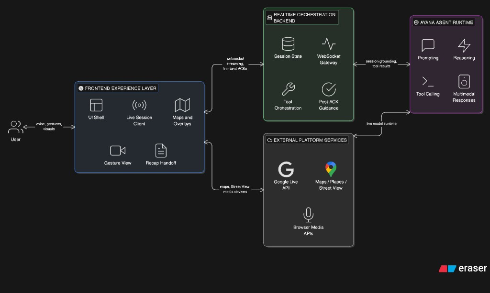

# Ayana

Ayana is a multimodal AI travel guide that turns trip planning into an immersive, cinematic journey. Instead of asking users to bounce between tabs, filters, spreadsheets, and reviews, Ayana lets them explore a destination as if the trip has already begun: a live voice guide, a 3D globe, cinematic landmark fly-ins, nearby discovery, Street View immersion, gesture controls, and a story-like recap at the end.

It is both a product experience and a systems project: a Next.js frontend, a FastAPI orchestration backend, a realtime Gemini Live voice agent, Google Maps 3D + Places + Street View integrations, a recap pipeline, and a Snap AR extension.

---

## Contents

1. [Inspiration](#inspiration)
2. [What It Does](#what-it-does)
3. [Experience Flow](#experience-flow)
4. [Architecture At A Glance](#architecture-at-a-glance)
5. [How We Built It](#how-we-built-it)
6. [Repository Structure](#repository-structure)
7. [Getting Started](#getting-started)
8. [Technical Docs](#technical-docs)
9. [Challenges We Ran Into](#challenges-we-ran-into)
10. [Accomplishments We're Proud Of](#accomplishments-were-proud-of)
11. [What We Learned](#what-we-learned)
12. [What's Next For Ayana](#whats-next-for-ayana)

---

## Inspiration

We have all been there: 47 open browser tabs, three spreadsheets, and a group chat full of conflicting opinions just to plan a weekend trip. Travel planning is fragmented, overwhelming, and joyless before the journey even begins.

We wanted to invert that entirely. What if planning a trip felt like the trip itself? What if an AI guide could take you by the hand, narrate your destination, fly you over landmarks in cinematic 3D, and let you explore with your voice and hands instead of a search bar?

That idea became **Ayana**: not just a travel tool, but a travel experience.

---

## What It Does

Ayana turns itinerary generation, exploration, and recap into one continuous multimodal flow.

- You begin by choosing a **persona** such as Adventurer, Romantic, or Wanderer.
- Ayana's prep engine generates **three curated itineraries** tailored to that persona using **Gemini 2.5 Flash**.
- A **cinematic loading screen** with orchestrated text phases and ambient audio transitions you into the experience.
- The app opens into a live **Google Maps 3D globe** where Ayana becomes a real-time spoken guide.
- A **Gemini Live** voice agent narrates your journey, explains landmarks, answers questions, and drives map actions through tool calls.
- You can steer the session with **voice**, **gesture input**, or direct taps.
- At any point, Ayana can open **nearby food / shopping / activities** and step inside a place using **Street View**.
- When the session ends, Ayana generates a **Spotify Wrapped-style recap** from the transcript and visited locations.
- A companion **Snap "Teleport Me" lens flow** extends the experience into AR by placing you inside 360-degree panoramas of destinations.

The result is a travel planner that feels less like search and more like being guided through a cinematic world.

---

## Experience Flow

```text
Persona selection
  -> Prep generation
  -> Cinematic loading
  -> Itinerary choice
  -> Live Ayana voice session
  -> Landmark fly-ins + nearby exploration + Street View
  -> End session
  -> Story-style recap
  -> Optional Snap AR teleport moment
```

In the live journey itself, Ayana follows a guided-then-interactive pattern:

1. Ayana introduces the selected city and proactively moves into the first landmark.
2. After each landmark arrival, Ayana explains what the user is seeing.
3. Ayana then offers the next choice: nearby food, shopping, activities, or the next landmark.
4. If the user chooses a nearby place, Ayana opens Street View and narrates the scene from that exact visible place context.
5. After several landmarks, Ayana can offer a soft wrap-up and transition into recap.

---

## Architecture At A Glance



The diagram above is the primary architecture view for the project. It shows the real runtime split between:

- the frontend experience layer
- the realtime orchestration backend
- the Ayana agent runtime
- external platform services
- the user interaction surface

The key architectural rule is simple but important:

- the agent decides intent
- the backend emits a typed `frontend_action`
- the frontend performs the visible work
- the frontend sends back a `frontend_ack`
- only then does the backend treat the state transition as complete

That ACK-gated loop is what keeps Ayana's narration synchronized with what the user is actually seeing.

For the full technical walkthrough, see [`docs/AYANA_END_TO_END_TECHNICAL_ARCHITECTURE.md`](docs/AYANA_END_TO_END_TECHNICAL_ARCHITECTURE.md).

---

## How We Built It

### Frontend

The frontend is built with **Next.js 16**, **React 19**, and **TypeScript**. The core experience lives on a single persistent globe-first page and uses the **Google Maps JavaScript API 3D (`v=alpha`)** for cinematic navigation.

Key frontend capabilities:

- globe-first landing experience
- cinematic city and landmark overlays
- itinerary selection UI
- live agent session bridge
- nearby discovery sidebar
- Street View overlay
- gesture camera panel
- recap page with animated card flow and ambient audio

### Cinematic map system

The map runtime uses programmatic camera movement and custom orchestration helpers for:

- city fly-ins
- landmark arrivals
- range / tilt selection
- Street View entry and exit
- overlay timing

Ayana also uses a **SmartRange** system in `frontend/lib/maps/smartRange.ts` to compute better arrival ranges dynamically. It combines name heuristics, place scale, viewport size, and **Google Maps `ElevationService`** terrain data so high-altitude destinations do not visually collapse the camera.

The elevation-adjusted distance logic is:

```text
adjustedRange = sqrt(baseRange^2 + altitude^2) * 1.1
```

That lets the same cinematic system handle beaches, cities, towers, and mountains without brittle per-location hardcoding.

### Gesture engine

Gesture input runs client-side in the browser using **MediaPipe Hand Landmarker**. The repo currently includes a gesture pipeline and classifier logic in the frontend so users can explore the map without relying only on mouse or keyboard input.

### Voice agent

Ayana's live guide is powered by the **Gemini Live API** through the **Google Agent Development Kit (ADK)**. The backend runs a realtime bidirectional session and exposes typed tools including:

- `choose_itinerary`
- `move_to_landmark`
- `show_nearby`
- `open_place_street_view`
- `end_session`

Audio is streamed over WebSocket and played through a custom **AudioWorklet** pipeline for low-latency PCM playback. The current live voice defaults to **`Gacrux`**.

### ACK-gated orchestration

This is one of Ayana's most important implementation ideas.

Visible actions such as moving to a landmark, opening nearby results, entering Street View, or ending the session are not treated as complete the moment the agent calls a tool. Instead:

1. the backend returns a tool result with an embedded `frontend_action`
2. the frontend performs the actual visible transition
3. the frontend captures the resulting state when needed
4. the frontend sends a `frontend_ack`
5. the backend updates session state and sends post-ACK semantic guidance back into the agent loop

This is what allows Ayana to narrate from what the user is actually seeing, not what the model merely intended.

### Prep pipeline

The prep flow uses **Gemini 2.5 Flash** to generate structured persona-matched itineraries before the live session begins. The prep response seeds:

- the itinerary selection UI
- the live session context
- landmark sequencing
- narrative grounding used in the agent prompt

### Recap engine

When the live session ends, Ayana builds a recap from:

- the conversation transcript
- location events collected during the session
- destination metadata and images

The recap service uses **xAI Grok (`grok-3-mini`)** to extract structured summary data such as:

- visited stops
- food picks
- activities
- traveller DNA traits
- exploration stats
- vibe shifts

It then enriches stops with **Google Places** imagery and renders them into a recap flow designed to feel closer to Spotify Wrapped than a generic itinerary summary.

### Snap AR extension

The `snap/` workspace contains the **Teleport Me** extension for Lens Studio. It uses **Street View Static API** cubemap generation and Lens Studio scripts to place the user inside destination panoramas as an AR selfie-first experience.

This gives Ayana a second medium: web for planning and guided exploration, Snap for physically stepping into the destination.

---

## Repository Structure

```text
Ayana/
|-- frontend/   # Next.js app: globe UI, maps, live session client, recap
|-- backend/    # FastAPI + ADK live agent, prep pipeline, recap services
|-- docs/       # Architecture, orchestration notes, integration references
|-- snap/       # Lens Studio workflow and panorama asset generation
`-- README.md
```

### Important paths

| Path | Purpose |
|------|---------|
| `frontend/app/page.tsx` | Main Ayana runtime shell |
| `frontend/components/live-agent/LiveAgentSession.tsx` | Frontend live websocket bridge |
| `frontend/lib/maps/cameraControls.ts` | Cinematic map and Street View primitives |
| `frontend/lib/maps/smartRange.ts` | Dynamic camera distance calculation with elevation support |
| `frontend/app/recap/page.tsx` | Recap experience |
| `backend/app/main.py` | FastAPI websocket server entry point |
| `backend/app/ayana_orchestration.py` | Session state + frontend action / ACK helpers |
| `backend/app/ayana_tools.py` | Tool layer exposed to the agent |
| `backend/app/ayana_tool_handlers.py` | Post-ACK follow-up orchestration |
| `backend/app/ayana_agent/agent.py` | Live Ayana agent definition |
| `backend/app/ayana_recap/service.py` | Grok recap extraction + Places photo enrichment |
| `docs/AYANA_END_TO_END_TECHNICAL_ARCHITECTURE.md` | Full end-to-end technical architecture |
| `docs/BACKEND_INTEGRATION.md` | WebSocket protocol and integration details |
| `snap/README.md` | Snap teleport extension overview |

---

## Getting Started

### Prerequisites

- **Node.js** 20+
- **Python** 3.10+
- **uv** recommended for the backend
- a **Google API key** with the right Maps / Gemini services enabled
- an **xAI Grok API key** if you want recap generation

### Google services you will likely need

- Maps JavaScript API
- Map Tiles API
- Places API
- Street View Static API for Snap asset generation
- Gemini API access, or Vertex AI if using that path

---

## Local Startup Instructions

If you want to run the full Ayana web experience locally, you need:

- `frontend/.env.local`
- `backend/app/.env`
- one terminal for the backend
- one terminal for the frontend

The backend should be started first, then the frontend.

### Step 1: Create `backend/app/.env`

Create `backend/app/.env` with the live agent and recap credentials:

```env
GOOGLE_GENAI_USE_VERTEXAI=FALSE
GOOGLE_API_KEY=your_google_api_key
DEMO_AGENT_MODEL=gemini-2.5-flash-native-audio-preview-12-2025
DEMO_AGENT_VOICE=Gacrux

# Optional: only if you want recap generation
GROK_API_KEY=your_xai_key

# Optional: use these instead of GOOGLE_API_KEY if running through Vertex AI
# GOOGLE_CLOUD_PROJECT=your_project_id
# GOOGLE_CLOUD_LOCATION=us-central1
```

Notes:

- `backend/app/main.py` loads environment variables specifically from `backend/app/.env`.
- `GOOGLE_API_KEY` is used by the prep pipeline and the non-Vertex Gemini path.
- `GROK_API_KEY` is only required for the recap generation flow.

### Step 2: Create `frontend/.env.local`

Create `frontend/.env.local`:

```env
NEXT_PUBLIC_MAPS_API_KEY=your_google_maps_key
NEXT_PUBLIC_LIVE_AGENT_WS_URL=ws://localhost:8000/ws
NEXT_PUBLIC_ENABLE_LIVE_AGENT=true
AYANA_BACKEND_BASE_URL=http://127.0.0.1:8000
```

Notes:

- `NEXT_PUBLIC_LIVE_AGENT_WS_URL` can also fall back to `NEXT_PUBLIC_WS_URL`.
- `.env.local` is gitignored and should never be committed.
- The frontend loads Google Maps 3D via the Maps JavaScript API script in `frontend/app/layout.tsx`.
- `AYANA_BACKEND_BASE_URL` is used by the frontend's server-side proxy routes for prep and recap calls.

### Step 3: Install dependencies

Backend:

```bash
cd backend
uv sync
```

Frontend:

```bash
cd frontend
npm install
```

### Step 4: Start the backend

Start the backend from `backend/app`:

```bash
cd backend/app
uv run --project .. uvicorn main:app --reload --host 0.0.0.0 --port 8000
```

This starts:

- the FastAPI app
- the live websocket server
- the prep endpoints
- the recap endpoints

The websocket base URL used by the frontend is:

```text
ws://localhost:8000/ws
```

The frontend appends the session-specific path dynamically at runtime.

### Step 5: Start the frontend

In a second terminal:

```bash
cd frontend
npm run dev
```

The app will be available at [http://localhost:3000](http://localhost:3000).

### Step 6: Open Ayana

Open:

```text
http://localhost:3000
```

Recommended flow for a full local test:

1. choose a persona
2. wait for prep generation
3. select an itinerary
4. allow microphone access if you want live voice interaction
5. explore landmarks, nearby places, and Street View
6. end the session to verify the recap flow

### Common setup notes

- The same Google Cloud project can be used for both frontend Maps access and backend Gemini access, as long as the necessary APIs are enabled.
- If `NEXT_PUBLIC_ENABLE_LIVE_AGENT` is `false`, the frontend can still render non-live portions of the experience, but the live Ayana session will stay disabled.
- If `GROK_API_KEY` is missing, the live session can still run, but recap generation will not complete successfully.
- If you use Vertex AI instead of direct Gemini API access, set `GOOGLE_GENAI_USE_VERTEXAI=TRUE` in `backend/app/.env` and provide the Vertex project settings.

---

## Snap Extension Setup

The Snap extension is optional, but it is part of the full Ayana concept.

To generate panorama assets:

```bash
cd snap/scripts
pip install requests Pillow
export GOOGLE_API_KEY=your_google_api_key
python generate_cubemaps.py
```

Then see:

- [`snap/README.md`](snap/README.md)
- [`snap/lens/LENS_SETUP.md`](snap/lens/LENS_SETUP.md)

for the Lens Studio flow and teleport lens setup.

---

## Technical Docs

If you are trying to understand or extend the system, start here:

- [`docs/AYANA_END_TO_END_TECHNICAL_ARCHITECTURE.md`](docs/AYANA_END_TO_END_TECHNICAL_ARCHITECTURE.md) for the full live system architecture and sequence diagrams
- [`docs/BACKEND_INTEGRATION.md`](docs/BACKEND_INTEGRATION.md) for protocol and integration details
- [`frontend/README.md`](frontend/README.md) for frontend-specific local notes
- [`backend/README.md`](backend/README.md) for the underlying ADK demo/backend reference
- [`snap/README.md`](snap/README.md) for the Snap AR extension

---

## Challenges We Ran Into

### Real-time agent tool orchestration

This was the hardest problem in the project.

The **Gemini Live API** is a continuous bidirectional stream, not a neat request/response API. That means tool calls, audio input, audio output, screenshots, ACKs, and follow-up narration all have to coexist in one live session without racing each other.

The solution was an ACK-gated protocol:

- the agent emits a tool call
- the backend turns that into a `frontend_action`
- the frontend executes the real visual transition
- the frontend returns an ACK, often after capturing a screenshot
- the backend only then advances the journey state and prompts the next semantic beat

Getting this stable without drift, duplicate transitions, or narration mismatches took significant iteration.

### Camera distortion on mountains

The Google Maps 3D camera `range` parameter behaves like a ground distance, not a universal cinematic framing tool. A range that looks perfect at sea level can visually collapse on elevated terrain such as Mount Fuji.

Ayana solves this dynamically by incorporating live terrain elevation:

```text
adjustedRange = sqrt(baseRange^2 + altitude^2) * 1.1
```

That allows one cinematic system to work across very different terrain profiles.

### MediaPipe lifecycle inside Next.js

Running browser-side vision workloads inside a modern React / Next.js app requires careful initialization and cleanup. Gesture systems, WASM loading, camera lifecycles, and client-only rendering all need to stay coordinated to avoid duplicate initialization or unstable runtime behavior.

### Recap page performance and polish

The recap experience is animation-heavy and design-sensitive. Ambient audio, card sequencing, timed transitions, and DOM-heavy UI all had to be smoothed out so the end of the journey felt deliberate rather than like a debug screen.

### Realtime session shutdown

Ending a live voice session cleanly turned out to be non-trivial. Ayana now waits not only for the logical `end_session` flow, but also for assistant output to go quiet and browser audio playback to drain before navigating into recap.

---

## Accomplishments We're Proud Of

- A full end-to-end multimodal loop: voice in, map moves, Ayana narrates the result, and the session stays visually grounded in realtime.
- Screenshot-based grounding that improves the agent's spatial narration after visible actions.
- A dynamic camera system that can handle sea-level cities and high-altitude landmarks in one runtime.
- A guided-then-interactive orchestration flow that feels more like storytelling than command execution.
- A recap system that turns raw transcript and location events into a narrative artifact rather than a generic summary.
- A cross-medium concept that connects web exploration to an AR teleportation moment in Snap.

---

## What We Learned

- Multimodal systems need explicit contracts. Typed tool shapes, frontend actions, ACKs, and session state mattered just as much as prompt design.
- Visual grounding works. Once the agent has confirmation of what the user is actually seeing, its narration becomes noticeably more precise.
- Immersion is fragile. One broken transition, jarring layout change, or clipped final audio line can break the spell.
- Realtime audio plus tool orchestration is more of a distributed systems problem than a normal chat UI problem.
- The combination of web and AR is stronger than either one on its own when the transition is intentional.

---

## What's Next For Ayana

- **Multi-city journeys** so Ayana can guide users across multiple destinations in one session.
- **Persistent travel memory** so future itineraries can adapt to prior preferences and skips.
- **Collaborative exploration** so multiple users can share the same journey session.
- **Booking integrations** that turn a recap into actionable travel planning.
- **Deeper Snap integration** so the teleport moment can happen mid-session at the most emotional point.
- **Broader geography and more personas** with stronger cultural grounding and wider itinerary coverage.

---

## Closing Note

Ayana sits at the intersection of storytelling, realtime AI orchestration, spatial interfaces, and travel discovery. The project is as much about interaction design as it is about models or APIs: the ambition is not merely to answer travel questions, but to make planning feel like exploration.
