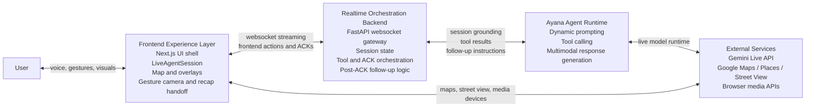
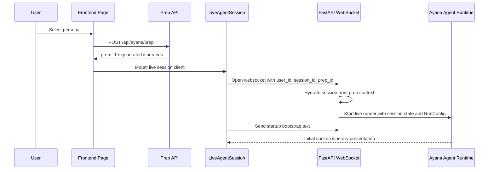
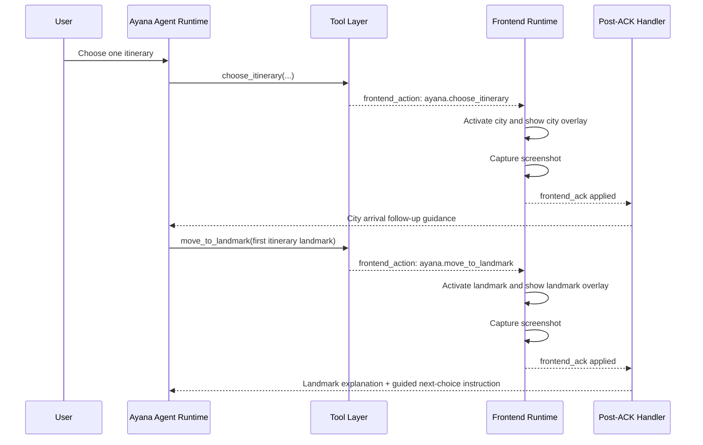
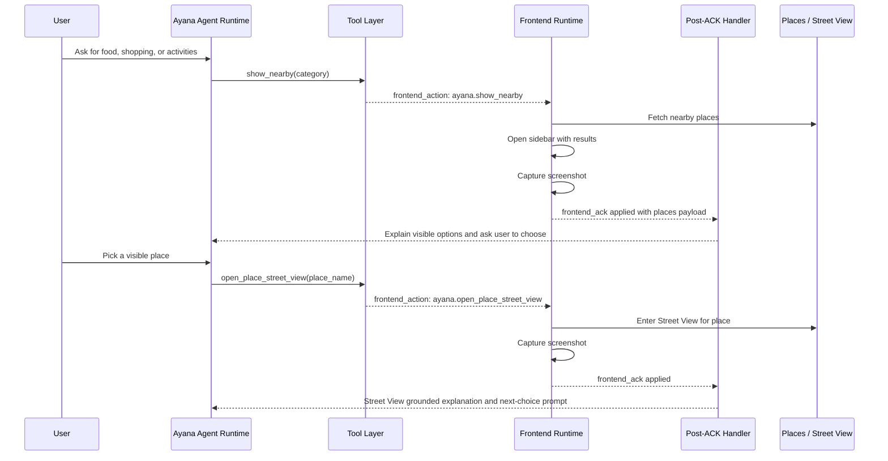
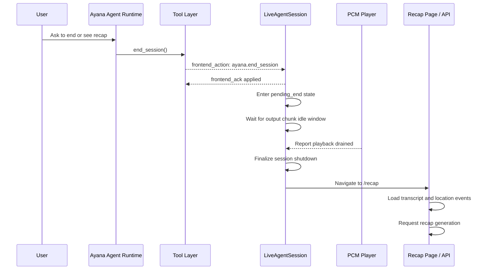

# Ayana End-To-End Technical Architecture

This document describes the current end-to-end technical architecture of Ayana at a high level, while still capturing the critical implementation details that shape the runtime behavior.

The goal of this document is to answer four questions:

1. What are the main system boundaries?
2. How does a live Ayana session actually run?
3. How do visible frontend actions stay synchronized with backend state?
4. What are the core request and orchestration flows from prep to recap?

---

## 1. System Overview

Ayana is a real-time multimodal travel experience composed of five major parts:

1. Browser user interaction
2. Frontend experience layer in Next.js
3. Realtime orchestration backend in FastAPI
4. Ayana live agent runtime powered by Google ADK / Gemini Live
5. External platform services such as Maps, Places, Street View, and browser media APIs

At a high level:

- The frontend owns the visual truth of the experience.
- The backend owns live orchestration state and ACK-gated coordination.
- The live agent decides what Ayana says and which orchestration tools to call.
- All visible transitions are executed on the frontend and only treated as complete after a frontend acknowledgement.

---

## 2. High-Level Architecture

### Key architectural rule

Ayana does not assume that a visible transition is complete when a tool is accepted. Instead:

- the agent calls a tool
- the backend emits a `frontend_action`
- the frontend performs the visible work
- the frontend sends `frontend_ack`
- the backend updates authoritative journey state and sends post-ACK follow-up guidance

That ACK-gated loop is the central design principle of the live experience.

---

## 3. Main Runtime Layers

## 3.1 User And Browser Layer

This layer includes:

- microphone input
- gesture camera input
- map and overlay rendering
- speaker playback
- user interaction through voice, gestures, and visible UI

The browser is not just a display surface. It is also the execution environment for:

- live audio capture
- gesture detection
- Street View rendering
- screenshot capture before ACKs
- transcript persistence for recap

---

## 3.2 Frontend Experience Layer

The frontend is primarily implemented in `frontend/app/page.tsx` plus supporting runtime components.

Its responsibilities are:

- manage the top-level experience stages
- render itinerary selection and runtime UI
- own the map, overlays, sidebar, and Street View
- connect to the backend live websocket through `LiveAgentSession`
- execute visible frontend actions
- collect transcript and location event data for recap

### Main frontend subsystems

#### A. Page Runtime Shell

The page runtime controls the main stage machine:

- persona selection
- prep loading
- session connecting
- generated itinerary selection
- runtime

It also decides when runtime-only UI should appear, such as:

- mic controls
- gesture camera panel
- runtime widget
- city / landmark overlay

#### B. LiveAgentSession

`frontend/components/live-agent/LiveAgentSession.tsx` is the realtime bridge between frontend and backend.

It is responsible for:

- opening the websocket
- sending the startup bootstrap text once per session
- streaming microphone audio to the backend
- receiving tool results, live text, and audio
- handling frontend actions
- capturing screenshots before certain ACKs
- sending `frontend_ack`
- managing reconnect behavior
- delaying end-session teardown until output and playback are drained

#### C. Map Runtime Layer

This layer executes the visible journey primitives:

- city activation
- landmark activation
- nearby discovery sidebar
- Street View entry and exit
- cinematic overlays

These are the user-visible actions the backend asks the frontend to perform.

#### D. Gesture Layer

The gesture system uses a hidden or embedded camera feed plus a gesture engine to detect hand gestures and drive map controls.

This layer is browser-local and does not depend on the backend orchestration loop.

#### E. Transcript / Recap Handoff

The frontend stores conversational turns and location events locally and uses them later to drive recap generation.

---

## 3.3 Realtime Orchestration Backend

The backend entry point is `backend/app/main.py`.

Its responsibilities are:

- accept websocket connections from the frontend
- validate the presence of `prep_id`
- build the Live `RunConfig`
- create or resume a session via ADK
- relay realtime audio, text, images, and acknowledgements
- maintain an in-memory orchestration state
- send tool results and frontend actions back to the client

### Main backend subsystems

#### A. FastAPI WebSocket Gateway

The websocket endpoint coordinates three concurrent concerns:

- upstream messages from frontend to the live request queue
- downstream live events from the ADK runner to the frontend
- background relay of tool results and extracted frontend actions

#### B. Session Orchestration State

`backend/app/ayana_orchestration.py` stores lightweight in-memory state per live session.

It currently tracks:

- generated itineraries
- selected itinerary
- active city
- active landmark
- nearby places and category
- sidebar visibility
- Street View visibility and active place
- visited landmark names and count
- wrap checkpoint state
- session ending state
- pending jobs and ACK metadata

#### C. Tool Layer

`backend/app/ayana_tools.py` defines the tool surface exposed to the live agent:

- `choose_itinerary`
- `move_to_landmark`
- `show_nearby`
- `open_place_street_view`
- `end_session`

These tools do not directly manipulate the frontend. They produce tool results and embed `frontend_action` payloads that the frontend later executes.

#### D. Post-ACK Semantic Handler

`backend/app/ayana_tool_handlers.py` is where the guided journey behavior becomes visible.

After a successful `frontend_ack`, this layer:

- updates session state
- interprets the visible result that just completed
- returns follow-up semantic guidance back into the live agent loop

This is what enables:

- proactive move into the first landmark after itinerary selection
- grounded explanation after landmark arrival
- interactive nearby choice flow
- Street View follow-up narration
- wrap-up offer and end-session behavior

---

## 3.4 Ayana Agent Runtime

The live agent is defined in `backend/app/ayana_agent/agent.py` and prompted by `backend/app/ayana_agent/prompt.py`.

The runtime responsibilities are:

- interpret the user's intent
- stay grounded in the current itinerary and session context
- call orchestration tools
- produce live spoken responses
- follow strict accepted-phase and post-ACK behavior rules

This layer is intentionally separated from visible frontend execution. The agent decides intent; the frontend performs visible reality.

---

## 3.5 External Services

Ayana depends on the following external systems:

- Gemini Live API through Google ADK for multimodal realtime generation
- Google Maps / Maps 3D for map rendering and camera movement
- Google Places for nearby discovery
- Google Street View for place-level immersion
- browser media APIs for microphone and gesture camera streams

---

## 4. Core Orchestration Principle: ACK-Gated Visible Truth

The most important technical pattern in Ayana is the split between:

- accepted intent
- visible completion

For example, when the agent calls `move_to_landmark`, the tool result being accepted does not mean the user has actually arrived yet. Arrival is only authoritative after the frontend finishes the visible movement and returns a successful `frontend_ack`.

This prevents several classes of errors:

- the agent narrating a place before the camera has visibly reached it
- backend state drifting away from what the user currently sees
- Street View or sidebar state being treated as active before the frontend actually entered that state

---

## 5. End-To-End Flow Summaries

## 5.1 Prep And Live Session Startup

This flow creates the itinerary set and starts the live websocket session.

### Important implementation note

The first startup message is currently bootstrapped from the frontend after websocket connection, not from a standalone backend startup turn.

---

## 5.2 Choose Itinerary And Move Into First Landmark

This flow is where Ayana transitions from prep into guided runtime.

### Important implementation note

The first landmark move is deliberately handled differently from later landmark transitions. The accepted tool-result prompt for the first landmark move is suppressed so the system can move cleanly into the landmark without an extra transitional spoken beat.

---

## 5.3 Nearby Discovery And Street View

This flow covers the interactive exploration loop after a landmark has been reached.

### Important implementation note

`open_place_street_view` is validated against the current nearby result set, which ensures the agent cannot drift into a place name that was not actually shown to the user.

---

## 5.4 End Session And Recap

The end-session path is intentionally more careful than a normal tool action because it needs to shut down a realtime stream cleanly.

### Important implementation note

The current implementation waits for both:

- no more assistant output activity during the idle drain window
- audio playback to drain in the PCM player worklet

There is still a max-drain fallback to prevent permanent hanging.

---

## 6. Frontend / Backend Message Model

At the highest level, there are four important message categories in the live websocket flow:

### Frontend to backend

- microphone audio frames
- bootstrap and follow-up text content
- screenshot image payloads
- `frontend_ack`

### Backend to frontend

- tool results
- live text and audio events from the model
- `frontend_action`

### Why this split matters

Tool results are not the same thing as frontend actions:

- tool result: what the agent attempted
- frontend action: what the frontend should visibly perform

This distinction makes the orchestration loop explicit and traceable.

---

## 7. Runtime State Model

Ayana's session state is intentionally lightweight and in-memory.

The most important fields are:

- `generated_itineraries`
- `selected_itinerary_id`
- `current_city`
- `current_landmark`
- `nearby_places`
- `nearby_category`
- `street_view_visible`
- `current_street_view_place`
- `visited_landmark_names`
- `visited_landmark_count`
- `wrap_checkpoint_offered`
- `session_ending`
- `pending_jobs`

These are enough to support the current orchestration model without turning the backend into a fully persistent workflow engine.

---

## 8. Important Design Decisions

### 8.1 Frontend owns visible truth

The frontend is the only place where the actual map, overlays, sidebar, Street View, and recap navigation exist.

### 8.2 Backend owns orchestration truth

The backend owns the authoritative live session context and only advances state after the frontend confirms visible completion.

### 8.3 Post-ACK follow-up is where the storytelling flow lives

The backend does not just wait for the next user utterance after every action. Instead, it uses post-ACK semantic follow-up messages to shape the guided flow.

### 8.4 The first landmark transition is special

The first landmark move is treated as a more seamless continuation of itinerary entry rather than a fully separate conversational beat.

### 8.5 End-session is drain-aware

Recap navigation is delayed until both stream activity and playback have drained, which prevents cutting off the final audible response.

---

## 9. Suggested Use Of This Document

Use this document as the main reference when you need to:

- understand the Ayana live system boundary-by-boundary
- explain the ACK-gated orchestration model to another engineer
- reason about where a live-session bug belongs
- design future live tools or new frontend actions
- extend the journey flow without breaking visible synchronization

If needed, this document can later be paired with:

- a separate low-level protocol reference
- a dedicated API contract document
- narrower feature docs for prep, recap, gestures, or Street View

