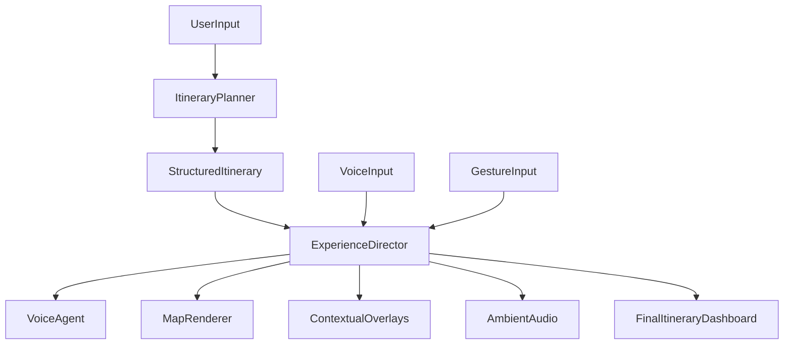

# Ayana — Product Reference

This document is the internal source of truth for what Ayana is intended to become as a product.

It is not a technical implementation guide. It defines the product identity, user experience model, system shape, and v1 scope so future design and engineering decisions can be judged against a single reference.

---

## 1. Product Definition

Ayana is a multimodal travel experience platform that helps users discover, refine, and finalize trips through a guided cinematic journey rather than a search-first workflow.

Ayana is defined as a real-time system that:

- interprets user travel intent or persona
- generates a structured itinerary
- presents that itinerary as a sequence of guided scenes
- leads the experience through a proactive voice agent
- supports user interaction through voice, gestures, and temporary visual overlays
- concludes with a practical itinerary dashboard the user can act on

Ayana should feel like exploring a trip before taking it.

---

## 2. Core Product Idea

Ayana is not primarily a chat assistant.

Ayana is a guided runtime that combines:

1. itinerary planning
2. agent-led narration
3. cinematic visual exploration
4. multimodal interaction
5. structured trip output

The product is successful when the user experiences travel planning as an immersive journey instead of a sequence of manual searches.

---

## 3. Core Principles

### 3.1 Agent-Driven Experience

The agent leads the flow. Ayana should not wait for user prompts at every step. The default behavior is proactive narration and progression.

### 3.2 Itinerary as Foundation

All experience logic is grounded in a structured itinerary. The itinerary is the backbone of the experience, not an afterthought.

### 3.3 Multimodal Interaction

Users should be able to influence the experience through voice, gestures, and visual context without breaking continuity.

### 3.4 Cinematic Presentation

Transitions, overlays, narration, and ambience should feel orchestrated rather than utility-driven. The product should minimize clutter and preserve immersion.

### 3.5 Adaptive Flow

The user can redirect the experience, but Ayana should remain coherent. Adaptation should feel natural, not like restarting the session every time the user intervenes.

### 3.6 Deterministic Control, AI-Generated Content

AI should generate itineraries, narration, recommendations, and supporting assets. Deterministic application logic should control state, progression, transitions, and reliability.

---

## 4. Product Architecture

Ayana should be understood as three core layers.

### 4.1 Itinerary Layer

This layer defines the structure of the journey.

It should produce:

- a destination-level plan
- ordered scenes
- scene metadata
- category context such as sightseeing, food, activities, and shopping

Each scene should represent a meaningful stage in the user journey.

### 4.2 Voice Agent

The voice agent is the delivery surface of the experience.

It should:

- narrate continuously
- introduce places and transitions
- explain why each scene matters
- trigger overlays and deeper exploration moments
- respond naturally to interruptions and user redirection

The agent should feel like a guide, not a reactive Q and A bot.

### 4.3 Orchestration Layer

This is Ayana's second brain.

It should:

- track the current scene and runtime state
- determine when to advance, pause, or redirect
- decide when overlays appear
- coordinate narration, gestures, map state, and interaction
- preserve continuity when the user interrupts

This layer should remain deterministic even when AI-generated content changes.

---

## 5. Mental Model

Ayana should be thought of as:

- a guided travel experience system
- a planner driven by exploration instead of search
- a multimodal interface that combines voice, visuals, gestures, and structured output

Ayana is not:

- a standard chat app with travel answers
- a passive itinerary page with added narration
- a fully open-ended sandbox where the model controls all system state

---

## 6. System Flow

The key product decision is that the `ExperienceDirector` owns flow, while the AI contributes content and recommendations.

---

## 7. Experience Flow

### Step 1: User Input

The user begins by selecting a persona or expressing a travel intent.

Example directions:

- adventure-focused
- food-focused
- relaxed or leisure-oriented
- custom travel intent

### Step 2: Itinerary Generation

Ayana generates a structured itinerary composed of scenes.

Each scene should have:

- a location or point of interest
- a narrative role
- content categories such as culture, food, activities, or shopping

### Step 3: Asset Preparation

Before the experience begins, the system prepares required assets wherever possible so the flow feels uninterrupted.

This may include:

- city mood visuals
- landmark visuals
- food and activity imagery
- scene summaries and keywords
- narration segments
- ambient audio tags

### Step 4: Experience Initiation

Ayana opens with a cinematic transition from a broad world view into the chosen destination.

### Step 5: Guided Exploration

The agent leads the user through the itinerary scene by scene, surfacing context, recommendations, and visual focus changes.

### Step 6: Interaction

The user may:

- interrupt the agent
- ask for different emphasis
- skip forward
- explore more deeply
- use gestures to navigate

### Step 7: Completion

The experience ends with a finalized itinerary dashboard that summarizes the journey and can be edited or acted on.

---

## 8. Scene Model

Scenes are the fundamental runtime unit of Ayana.

A scene should generally include:

- a location or anchor point
- a narrative objective
- a visual target
- category context
- ambient audio tag
- allowed user interaction modes

Typical scene types for v1 may include:

- destination introduction
- city essence
- landmark focus
- food discovery
- activity recommendation
- shopping moment
- recap or summary

The orchestration layer should move between scenes in a controlled way rather than allowing arbitrary drift.

---

## 9. Multimodal Interaction

### 9.1 Voice

Voice is the primary interactive channel.

Users should be able to:

- interrupt narration
- ask to focus on a category
- skip or modify parts of the journey
- request clarification or alternatives

### 9.2 Gestures

Gestures are a secondary control surface for exploration.

They should support:

- navigation
- zooming
- rotation
- lightweight spatial control

Gestures should augment the experience without taking it out of guided mode.

### 9.3 Visual Overlays

Overlays should appear only when contextually relevant.

Examples:

- sightseeing recommendations
- food suggestions
- activities
- shopping

They should be temporary and support the agent's narration rather than becoming the main interface.

---

## 10. Audio and Atmosphere

Ayana should use sound as part of the travel experience, not just as speech playback.

The audio layer may include:

- natural ambience
- urban ambience
- cultural or musical atmosphere
- social and market sound categories

Audio transitions should feel synchronized with scene changes and camera transitions.

---

## 11. Final Output

The experience should end with a practical itinerary dashboard.

The dashboard should include:

- an ordered timeline of stops
- a visual map overview
- detailed entries for each scene or stop
- editable structure for reordering or removing items

The purpose of the dashboard is to convert the cinematic exploration into an actionable trip plan.

---

## 12. AI Usage

AI should be used for:

- interpreting intent and persona
- generating itineraries
- generating narration
- generating recommendations
- summarizing place essence
- generating supporting assets where appropriate

AI should not be the sole controller of runtime state.

Flow control, scene progression, and interaction policy should remain application-owned.

---

## 13. V1 Product Scope

V1 should focus on a strong, coherent guided experience rather than maximum flexibility.

### V1 should include

- persona-based trip kickoff
- structured itinerary generation
- proactive voice-led journey
- multi-scene cinematic exploration
- contextual overlays for recommendations
- gesture-assisted navigation
- user interruption and limited redirection
- final itinerary dashboard

### V1 should avoid

- fully open-ended agent control of the application
- uncontrolled branching in every scene
- excessive UI density
- treating Ayana as a generic chat planner

---

## 14. Strategic Positioning

Ayana is positioned as:

- a guided travel experience
- an exploratory planning tool
- a multimodal travel interface

Its differentiation comes from continuity, immersion, and orchestration rather than from raw itinerary generation alone.

---

## 15. Working Definition

If a short internal definition is needed, use:

> Ayana is an agent-directed cinematic travel experience built on a structured itinerary and a deterministic orchestration layer.

---

## 16. How To Use This Document

Use this document as the product reference for:

- architecture decisions
- orchestration design
- scene design
- agent behavior design
- UI and interaction tradeoffs
- prioritization of v1 features

If a proposed feature conflicts with this document, the product behavior should be reconsidered before implementation proceeds.
