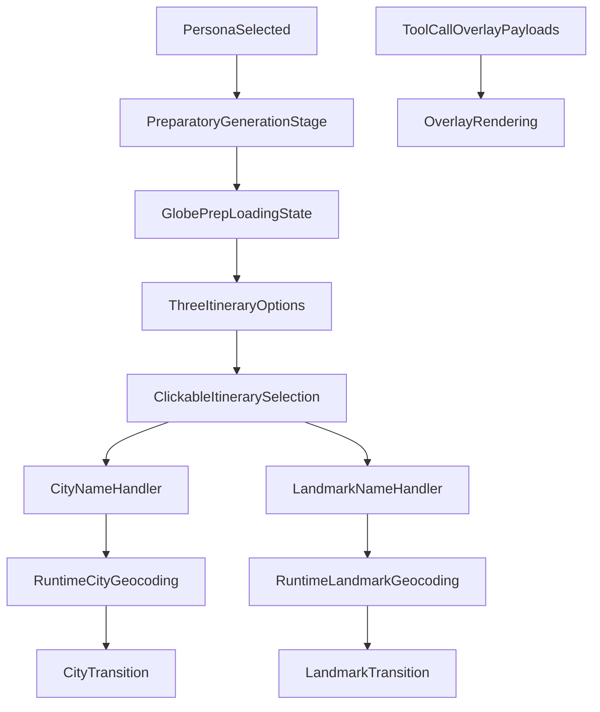

# Ayana Frontend — Next Phase Runtime Primitives

This document defines the next implementation phase for the Ayana frontend.

It is intentionally focused on the immediate build stage before agent orchestration. The goal of this phase is to replace hardcoded destination logic with generated itinerary data and a prep-first frontend flow, while keeping the system easy to test and debug.

---

## Status Note

This document is now mostly historical reference.

The runtime primitives it described have been substantially implemented, and Ayana has already moved into the orchestration phase on top of those primitives.

### What is already done

- prep-first persona to itinerary generation flow exists
- globe-centered prep loading state exists
- generated itinerary overlay exists
- live session boot now happens after prep completes
- shared city activation runtime exists
- shared landmark activation runtime exists
- runtime geocoding is in use for city and landmark movement
- overlay payloads from movement tools are being consumed by the frontend runtime
- the landmark flow preserves settle, overlay, and slow-orbit behavior

### What this document no longer represents

- it is no longer the current next phase
- the live session is no longer simply "disabled for this phase" in the actual app
- the app has already moved beyond pure primitive testing into ACK-gated live-agent orchestration

### What is current instead

The current implementation focus is the orchestration story:

- `choose_itinerary` implemented
- `move_to_landmark` implemented
- `show_nearby` implemented
- `open_place_street_view` implemented (uses `flyToPlaceStreetView`; explicit `hide_sidebar` tool not on the live surface)

Use the orchestration docs as the source of truth for current sequencing:

- `docs/AYANA_ORCHESTRATION_STORY.md`
- `docs/AYANA_ORCHESTRATION_PHASE_PLAN.md`

---

## 1. Purpose

The current frontend is a hardcoded cinematic prototype centered around Tokyo and a fixed Japan stop list.

The next phase should transform the frontend from:

- a hardcoded destination flow

into:

- a runtime renderer that can consume generated itinerary options
- a runtime renderer that can consume generated overlay payloads later
- a testable cinematic system for city and landmark transitions

This phase is explicitly **before** agent orchestration logic.

---

## 2. What Is In Scope

### 2.1 Persona-Based Generation Stage

After the user selects a hardcoded persona, the system should enter a preparatory stage.

In this stage:

1. LLM call 1 generates **3 itinerary options** for the selected persona
2. the frontend shows a smooth prep loading state over the globe
3. the frontend reveals the 3 generated options in a clickable overlay

The live Ayana session should **not** begin until this preparatory stage is complete.

### 2.2 Generated Itinerary Options

Each itinerary option should represent a city-level travel experience candidate.

Each option should include:

- city name
- country or region label if helpful
- a list of landmark names that can be explored
- a suggested order for exploration
- narrative hooks or facts that the voice guide can later use
- category signals such as food, sightseeing, shopping, or activities

For this phase, landmark and city names should be clear and canonical enough for runtime geocoding.

### 2.3 Overlay Payloads

This phase no longer depends on a separate generated `experience metadata` object in the prep response.

Instead:

- the prep response returns itinerary data only
- the frontend owns the current prep-loading and itinerary-selection visuals
- later agent tool calls will carry the minimal overlay payload the frontend needs

That later overlay payload should include only:

- display name
- overlay preset
- tagline

The current `CityOverlay.tsx` remains the first clear consumer of that future payload shape, but the prep response itself does not include it.

### 2.4 Frontend Runtime Testing Primitives

Before orchestration, the frontend should support manual test handlers for:

- entering a city name
- entering a landmark name

These handlers should validate:

- runtime geocoding
- city transition behavior
- landmark transition behavior
- overlay rendering driven by runtime payloads

These handlers are a primitive testing surface, not the final user experience.

### 2.5 Frontend Geocoding

For hackathon scope, geocoding should happen at runtime.

That means:

- itinerary options contain names, not pre-resolved coordinates
- when the frontend needs to move to a city or landmark, it resolves the name at runtime
- once coordinates are obtained, the existing map transition logic is used

This is the chosen simplicity tradeoff for the hackathon.

---

## 3. What Is Explicitly Out Of Scope

The following are **not** part of this phase:

- agent orchestration logic
- proactive narration logic
- tool contract refinement
- deterministic logic for interpreting the user’s spoken itinerary choice
- full voice-only experience enforcement
- final interruption logic

Those come only after the primitives in this document are working.

---

## 4. Live Session Behavior

During this phase, the Ayana live voice session should be disabled behind a flag.

### Reason

We want to validate the data flow and rendering primitives first:

- generated itinerary options
- smooth prep loading and itinerary selection flow
- city transition primitive
- landmark transition primitive
- overlay rendering behavior

Only after those are stable should the live session be re-enabled and orchestration layered on top.

---

## 5. Frontend Transformation Goal

The frontend should shift from:

- hardcoded content
- hardcoded scene progression
- hardcoded overlay logic

to:

- generated itinerary data
- prep-first overlay flow
- runtime geocoding
- renderer/executor behavior

The frontend should keep:

- map rendering
- camera transitions
- gesture layer
- overlay rendering
- sidebar rendering
- street-level immersion

The frontend should stop owning:

- hardcoded Tokyo destination logic
- fixed `JAPAN_STOPS` progression
- name-to-preset overlay mapping
- hardcoded destination subtitles and scene metadata

---

## 6. High-Level Runtime Model

At the end of this phase, the frontend should be capable of consuming:

- one selected itinerary option
- one city name for runtime resolution
- one landmark name for runtime resolution

The primitive runtime flow should look like this:

This is a testing/runtime shape only. The future orchestrated version will replace manual selection and manual handlers with agent-driven commands.

---

## 7. Scope Decisions That Are Locked

The following decisions are locked for this phase:

- persona remains hardcoded
- 3 itinerary options are generated after persona selection
- the frontend presents a globe-centered loading state during prep
- the frontend presents the 3 generated options in a clickable overlay
- Ayana live session starts only after the preparatory generation stage is complete
- the user will later choose by voice, but that choice interpretation logic is not part of this phase
- runtime geocoding is the selected approach
- itinerary outputs must use clear landmark and city names suitable for geocoding
- the frontend will gain test handlers for city-name and landmark-name entry
- overlay preset and tagline will later come from tool-call payloads, not prep metadata

---

## 8. Minimum Deliverables For This Phase

This phase is complete when all of the following are true:

1. Persona selection can trigger itinerary generation
2. Three itinerary options are produced
3. The globe-centered loading state appears during prep
4. One itinerary option can be selected for testing
5. The frontend can geocode a city name at runtime and transition to it
6. The frontend can geocode a landmark name at runtime and transition to it
7. Overlay rendering can consume runtime payloads instead of only hardcoded maps
8. The live session can be disabled so this workflow is testable in isolation

---

## 9. Why This Phase Comes Before Orchestration

If these primitives are not stable, orchestration will be difficult to debug.

This phase creates the building blocks required for the next stage:

- generated destination data
- prep-first cinematic selection flow
- dynamic transition primitives
- frontend renderer behavior

Only after these are working should the project move into:

- agent-driven selection
- proactive scene progression
- orchestration rules
- tool-level runtime contracts

---

## 10. Summary

The next phase is a primitives-and-integration phase.

It is not about making Ayana fully autonomous yet.

It is about proving that:

- generated itinerary options can replace hardcoded destination content
- prep overlays can replace the old persona-to-Tokyo handoff
- runtime geocoding can support dynamic city and landmark movement
- the frontend can act as a clean cinematic runtime before orchestration is introduced

This phase should be treated as the foundation for the later Ayana agent orchestration layer.
